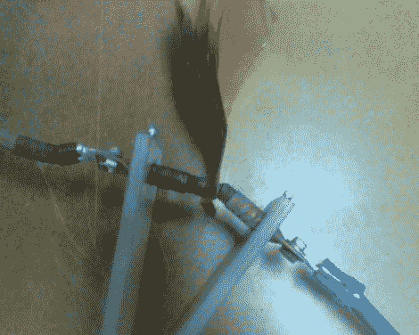

# DIY 点焊机可以连接任何东西，甚至铜

> 原文：<https://hackaday.com/2011/11/06/diy-spot-welder-can-join-anything-together-even-copper/>

Hackaday reader [David]正在寻找一种便宜又简单的方法将铜制的接头点焊在一起。正如他在文章中指出的那样，铜最诱人的属性，比如高热容，使得焊接变得更加困难。他自制的点焊方法被公认为又快又脏，但它确实很好地完成了工作。

他从四个 2.5V @ 2600 法拉的超级电容器阵列开始，这些电容器提供正确进行铜点焊所需的高电流。它们被串联起来，用粗电线连接到他的电极上。石墨电极本身是一个有趣的 DIY 作品，巧妙地使用铜管和石墨块构建而成。整个装置中最简单/最危险/最聪明的部分是他的触发机制，它由一对铜块组成，他用手将它们撞在一起以完成电路。

[大卫]很清楚，设置只是一个触摸粗糙，但据他说，它使伟大的焊接，这只是一个概念证明在这一点上。他对最终版本做了大量的改进，包括一种不同的切换方法和一些其他的安全预防措施。