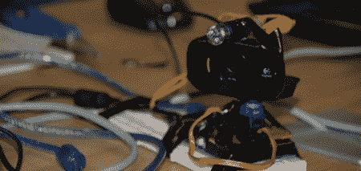

# 谷歌 Hangout 激光炮塔

> 原文：<https://hackaday.com/2011/11/07/google-hangout-laser-turret/>

来自约翰内斯堡 House4Hack hackerspace 的家伙凭借他们的[该死的激光炮塔](http://www.house4hack.co.za/?p=475)赢得了 2011 年 Google+黑客马拉松。该产品最初是一个远程控制的网络摄像头，任何人都可以在 Google+上控制它。这个团队突发奇想，决定在建筑中加入激光，因为激光太棒了。

这个设计的灵感来自于只要有人在黑客空间，就可以使用 Google+ hangout。如果一个客人不能亲自到场为团队增光，至少他们可以虚拟地到场。摄像机由运行 bog 标准伺服库实现的 Arduino 控制。Arduino 通过串行连接与笔记本电脑相连，能够左右移动。为了增加一点趣味，团队在 Arduino 上添加了一个由数字输出控制的 25mA 激光二极管。

为了赢得约翰内斯堡 Google+黑客马拉松，这些家伙为自己赢得了一部三星 Galaxy S II 手机。对于创造一些很酷的东西来说，这是一个不错的奖励。休息之后看看该死的激光炮塔的演示。

 <https://www.youtube.com/embed/_wC8sB24p9c?version=3&rel=1&showsearch=0&showinfo=1&iv_load_policy=1&fs=1&hl=en-US&autohide=2&wmode=transparent>

 <iframe class="youtube-player" width="800" height="480" src="https://www.youtube.com/embed/3XZ8dmARDPo?version=3&amp;rel=1&amp;showsearch=0&amp;showinfo=1&amp;iv_load_policy=1&amp;fs=1&amp;hl=en-US&amp;autohide=2&amp;wmode=transparent" allowfullscreen="true" style="border:0;" sandbox="allow-scripts allow-same-origin allow-popups allow-presentation"/> </body> </html>