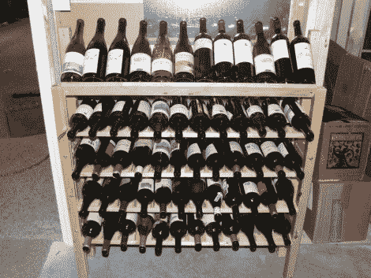

# 宜家酒架最初作为床垫架出售

> 原文：<https://hackaday.com/2011/11/07/ikea-wine-rack-originally-sold-as-a-mattress-holder/>

[杰里米·沃尔沃斯]又开始翻垃圾箱了。他注意到他的邻居在路边放了一桶好看的木头来收集垃圾。他打听了一下，得知是一张宜家的床坏了，原来的五金件还在一个单独的袋子里。他把它拖到自己的窝里，用零件做了这个酒架。

重复使用的轨道和硬件为瓶子提供了五个架子。[Jeremy]想让每个容器在架子没满的情况下保持在原位，所以他从家庭商店里拿了一块木制品，剪下隔板，然后粘在原位。现在，他只需花几美元的材料费，就能展示多达 60 瓶。

似乎宜家能够以低于当地原材料成本的价格出售家具。我们认为这是一种为你自己的黑客寻找零件的奇妙方式，因为损坏的组件通常可以被切割成未损坏的零件。我们还确保在每次访问时检查“原样”部分，查看通常廉价出售的“剩菜”。谁知道也许你会找到你需要的零件[建立一个记录项目的相机支架](http://hackaday.com/2011/10/12/cheap-ikea-camera-boom-ensures-shake-free-video/)。