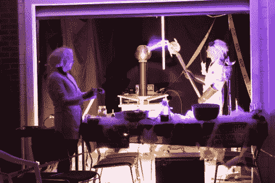

# 一个特斯拉线圈传送令人震惊的糖果

> 原文：<https://hackaday.com/2011/11/08/a-tesla-coil-that-delivers-shocking-candy/>

尽管万圣节已经过去了一周，我们仍然看到许多很酷的东西向我们走来。以[JJ]送给我们的这个特斯拉线圈为例。

他在活动前一周想到为他的万圣节展示制作一个线圈，但他认为这很容易做到，因为他手头已经有了很多零件。他最初从一些氖变压器和他在以前的特斯拉线圈制作中使用的初级/次级对开始，但当事情完全组装好后，他对结果并不完全满意。

他回到绘图板，缠绕一个新的初级/次级线圈对，性能要好得多。线圈的其余部分是用他在宜家购买的随机零件以及他周围的其他物品拼凑而成的。

他穿上一套疯狂科学家的装备，用一大把接地的钳子充当法拉第笼，用他的特斯拉线圈电击不给糖就捣蛋的人的糖果，这让邻居的孩子们非常高兴。

请务必浏览他的页面，以查看更多的建设细节，如果想先睹为快，看看下面的视频。

 <https://www.youtube.com/embed/XSuD4XiC9Nc?version=3&rel=1&showsearch=0&showinfo=1&iv_load_policy=1&fs=1&hl=en-US&autohide=2&wmode=transparent>

 </body> </html>