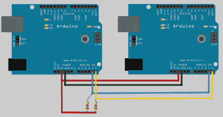

# 一种扩展 Arduino IO 容量的简单方法

> 原文：<https://hackaday.com/2011/11/08/a-simple-method-for-expanding-arduino-io-capacity/>

虽然有其他方法可以做到这一点，但[Rod]已经决定写下他使用两个 Arduino 和 I2C 协议来扩展一个 Arduino 的 IO 容量的方法。如上图所示，您将牺牲 2 个模拟引脚，但如果您碰巧需要 IO 并有一个额外的 Arduino，这真的会有所帮助。[Rod]还指出，如果情况需要，这种方法可以与许多 Arduino 并行使用。这个简单的代码也包括在内，所以如果你想尝试这个想法，一定要看看他的网站。

额外 IO 的一些其他解决方案将是购买一个有 54 个数字 IO 引脚的 [Arduino Mega](http://arduino.cc/en/Main/ArduinoBoardMega) 或给你 48 个 IO 的 [Muxshield](http://www.sparkfun.com/products/9832) (可堆叠用于其他屏蔽)。使用两个 Arduinos 的一个优点是，如果将来需要将它们分开用于不同的项目，这是可以做到的。因为每次攻击都是不同的，所以为您的 IO 需求提供选项是很好的。

休息后看看视频，看看一切都被连接起来。

 <https://www.youtube.com/embed/lZBZ_Nco1pc?version=3&rel=1&showsearch=0&showinfo=1&iv_load_policy=1&fs=1&hl=en-US&autohide=2&wmode=transparent>

 </body> </html>