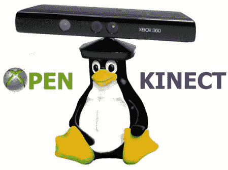

# Kinect 入门

> 原文：<https://hackaday.com/2011/11/13/a-kinect-primer/>

是的，Kinect 现在已经有一年多了，在[微软]最初的一些不快之后，它已经成为黑客的最好朋友。[Eric]决定用一篇关于它如何工作的文章来庆祝一下。如果你是这个硬件的新手，并且想开始使用它，这应该是一个很好的黑客入门。如果你最近一直在阅读[HAD]，你会注意到这个信息被用于[“为 500 块骨头建造一个 Kinect 机器人”](http://hackaday.com/2011/11/09/build-a-kinect-bot-for-500-bones/)

本文中一些有趣的事实包括 Kinect 测量了 307200 个距离点，在游戏领域称为“点云”。由此，它能够构建周围环境的 3D 图像，并允许交互。在 Adafruit 宣布悬赏 3000 美元向大众开放之后，这种有趣的硬件很快就被破解了。这仅仅用了四天时间，让人不禁要问，为什么[微软]拥有如此惊人的资源，却不能更有效地锁定它，或者正式开放它，让它被黑客攻击和修改。我们的投票是正式开放，但没有人咨询我们的决定。