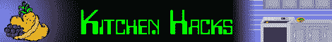
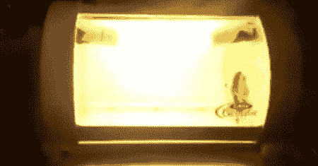

# [乔治·福尔曼]厨房用草本植物的幼苗启动器

> 原文：<https://hackaday.com/2011/11/08/george-foreman-seedling-starter-for-kitchen-herbs/>

有时候，最好的厨房秘诀并不在于最好的烤肉、最稀有的牛排或最熏肉。有时候你需要在你的盘子里加点颜色，孩子，那么为什么不在[【乔治·福尔曼】烤肉店温室](http://srhaemmerling.webs.com/)里种植你自己的药草呢？

[Sam]第一次看到他几乎没用过的烤肉店是在他朋友扔掉它的时候。像任何优秀的制造者一样，他很快就拿起它，开始做一些修改。在移除了像马达、加热元件和定时器这样有趣的部件后，[Sam]安装了两个紧凑型荧光灯来启动一些草药。

厨房香草园出奇的普遍，以至于整个论坛都致力于这种做法。[Sam]在他的幼苗起动器中还没有任何土壤，但当他有了土壤时，我们预计他将在春天收获一个罗勒、牛至或芫荽叶的好收成。

当然，[Sam]可以用他的种子启动器来种植更多的“非常规”植物，但是我们中的一些人已经因为种植石榴幼苗而被赶出宿舍，所以我们就此打住。