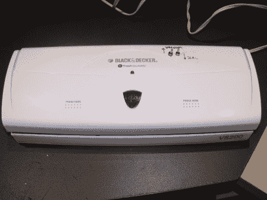

# 入侵 VS200 食品封口机

> 原文：<https://hackaday.com/2011/11/09/hacking-a-vs200-food-sealer/>

这台食品封口机不适合[修补工程师]，所以他决定做点什么。这个封口机的问题是它没有一个模式，可以简单地密封袋子，而不用抽真空。据报道，整个过程需要 40 秒来排空空气，然后密封袋子。在不抽真空的情况下，密封过程只需要 9 分钟。

在把所有东西拆开并四处查看后，发现了一个 PIC 微控制器、真空开关以及其他各种电子设备。虽然第一个想法是用 Arduino 替换板载 PIC，但还是达成了一个更简单的解决方案。增加了两个开关，一个用来关闭真空泵，另一个用来手动打开加热器。这将允许机器如最初预期的那样运行，或者简单地让袋子在没有真空功能的情况下被密封。

这个技巧可能不是我们见过的最先进的，但它很好地提醒了我们，如果你愿意四处看看，有些项目可以非常简单地完成！