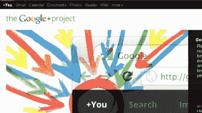

# Hackaday 现在正式拥有了一个 G+页面

> 原文：<https://hackaday.com/2011/11/07/hackaday-now-officially-has-a-g-page/>

最近有一个公告称 g+为企业和组织打开了 G+页面的大门。这意味着我们可以在谷歌的支持下拥有一个官方的 G+页面。我们[在这里开了一家](https://plus.google.com/b/114843073658390316652/)。我们计划不时举行“聚会”,这样人们可以炫耀他们所做的事情。如果你不喜欢 g+也不用担心。所有的故事仍然会在网站上发布。也许我们可以从[阿达果的书里拿一页，录下一些在线“展示和讲述”环节](http://www.youtube.com/watch?v=C0Y-ZQ9TwUY)，与你们分享。

当然，有时候单独关注作者会更有趣，因为我们更倾向于发表观点和非官方的信息，你可以很容易地找到我。对于其他人，你必须搜索他们的名字。他们现在都不在线，所以我可以请求允许链接到他们。