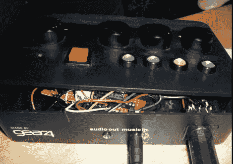

# 基于 Arduino 的 MIDI 合成器

> 原文：<https://hackaday.com/2011/11/08/arduino-based-midi-synth/>

[Charles Gershom]一直在摆弄他的键盘和 Arduino，以便构建他自己版本的 MIDI 控制合成器。它看起来像他已经掏空了一些商用 MIDI 硬件的外壳来用于这个项目。这很好，因为它给他提供了他需要的 MIDI 和音频插孔。这个盒子还提供了一个很好的控制界面，其中一组四个 led 显示当前使用的 synth 模式。面板上还安装了四个电位计，但它们尚未启动和运行。

休息后看看视频，看看目前为止这能做些什么。[Charles]显示了设备合成来自键盘的声音。它还被用来回放《超级马里奥兄弟》中的音频，这些音频是由电脑上的音乐符号程序输入的。当这种情况发生时，只有一个声音在播放，这使我们认为现在一次只能处理一个通道(但我们可能是错的)。

 <https://www.youtube.com/embed/1uWM50vazeQ?version=3&rel=1&showsearch=0&showinfo=1&iv_load_policy=1&fs=1&hl=en-US&autohide=2&wmode=transparent>

 </body> </html>