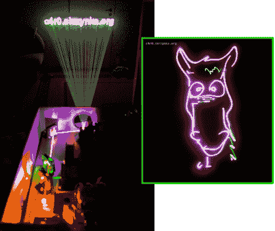

# RGB 激光投影仪是一个令人瞠目结舌的建筑

> 原文：<https://hackaday.com/2011/11/10/rgb-laser-projector-is-a-jaw-dropping-build/>

我们想不出比史诗更好的方式来描述这个激光投影仪项目。[C4r0]是格但斯克理工大学的一名学生，他研究这台投影仪至少有几年了。它使用几种不同的激光二极管，这些二极管来自 DVD 刻录机、蓝光驱动器和娱乐设备(绿色二极管来自迪斯科激光器)。

为了引导光束，他建造了一系列装有二向色滤光片的支架，二向色滤光片反射一些波长的光，同时允许其他光直接通过。每个二极管还需要一个驱动器，其中大部分是他从头开始构建的。一旦硬件设计完成并经过测试，我们该怎么做呢？如果你是[C4r0],你可以把它做成一个钱箱，结果看起来很专业。

休息之后不要错过视频演示。在你看上面链接的他的论坛帖子之前，确保你已经准备好抹布擦口水了。

[https://www.youtube.com/embed/Dx6HQ6KuvfU?version=3&rel=1&showsearch=0&showinfo=1&iv_load_policy=1&fs=1&hl=en-US&autohide=2&wmode=transparent](https://www.youtube.com/embed/Dx6HQ6KuvfU?version=3&rel=1&showsearch=0&showinfo=1&iv_load_policy=1&fs=1&hl=en-US&autohide=2&wmode=transparent)

[谢谢代码]