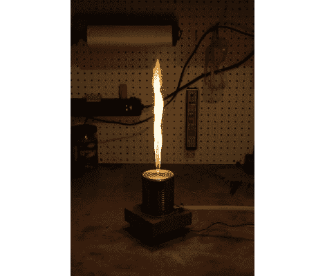

# 单列鲁本斯管

> 原文：<https://hackaday.com/2011/11/09/single-column-rubens-tube/>

这是一个火热的项目，帕特里克称之为他的烟火果酱罐。这是我们能想到的最简单的鲁本斯电子管。对于不知情的人来说，鲁本斯管使用可燃气体来显示通过供给容器的波形。在过去，我们已经看到有多个柱子的[项目](http://hackaday.com/2010/06/11/wiimote-controlled-rubens-tube/)，它们非常清晰地显示出驻波。但这个版本缺乏分辨率，所以波被视为一个调制的火焰高度。

你可以看到丙烷进料管从右边进入罐子。这可以保持气体稳定流动，但由乳胶气球制成的罐子底部的隔膜可以通过推动气体以略快于其流动的速度通过孔来调节火焰高度。休息后，底座中的扬声器将声波从振膜上弹回，以获得视频剪辑中看到的效果。

我们想知道罐子能否加热到足以融化另一端的气球？

 <https://www.youtube.com/embed/zGKzmi-NL-A?version=3&rel=1&showsearch=0&showinfo=1&iv_load_policy=1&fs=1&hl=en-US&autohide=2&wmode=transparent>

 </body> </html>