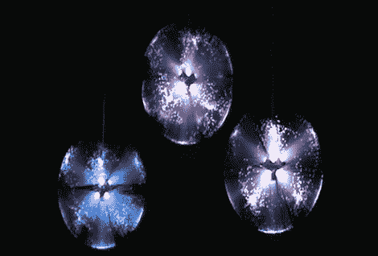

# 宜家单色光纤灯的 RGB 升级

> 原文：<https://hackaday.com/2011/11/10/rgb-upgrade-for-ikea-single-color-fiber-optic-lamp/>

五块钱就能给你买一盏宜家 STRÅ LA 斯特拉灯。这是一个电池供电的吊灯，通过光纤束的多个分支将光线传输出去。但是你只会得到白色的，这很无聊。[Boris]决定[将库存 LED 换成 RGB 单元](http://www.open-electronics.org/ikea-lamp-mod-strala/)，并用 Arduino 驱动它。

灯核只是几片塑料，拆开后可以看到一个 LED 所在的印刷电路板碎片。二极管的主体在顶部是平的，并且[Boris]将他的替换物归档以匹配形状因素。PCB 和电池组之间的导线只有两个导体，所以他用四个导体(R、G、B 和 GND)代替了它们。他的原型使用 Arduino 的 PWM 功能来控制颜色，但[Boris]建议在解决问题后，过渡到 PIC 12F675 或较小的 ATtiny 微控制器等简单芯片。

休息后看看这个片段的结果。

 <https://www.youtube.com/embed/R7X_gqVrlv0?version=3&rel=1&showsearch=0&showinfo=1&iv_load_policy=1&fs=1&hl=en-US&autohide=2&wmode=transparent>

 </body> </html>