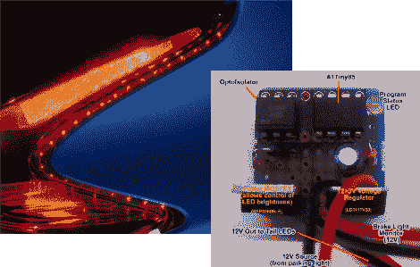

# LED 灯条和 UC 为您的尾灯增加一些闪光

> 原文：<https://hackaday.com/2011/11/11/led-strip-and-uc-add-some-flash-to-your-tail-lights/>

[戴夫]给他的新 2012 款尼桑 Juke 加了点尾灯改装。你可以看到灯罩边缘的轮廓是一系列的点。这是他为增加刹车灯而添加的 LED 灯条。它被粘在适当的位置，并具有侧面发光二极管，以便光线将集中在汽车后面。

为了控制带子，他使用了 ATtiny85 微控制器。它是右边的芯片，旁边的光隔离器保护它免受驱动该条的 12V 车辆电源的影响(通过 MOSFET)，并在踩下制动踏板时充当触发器。他在固件里写了一些特效。当灯打开时，在大约 8 秒钟内，光带逐渐消失 75%。当踩下制动踏板时，它们达到 100%。休息后看看视频(这对我们来说似乎有点奇怪，因为视频运行了 18 秒，但音频一直在继续… YMMV)。

我们已经看到了几个尾灯的概念，当你踩下踏板时，刹车灯会闪烁。不幸的是，Juke(以及据我们所知的所有其他汽车)没有内置的功能来感知你何时真正给了刹车一个突然的震动。这让我们想知道这些信息是否可以从 CANbus 中收集到？

[https://www.youtube.com/embed/BTQ5jPtHvq8?version=3&rel=1&showsearch=0&showinfo=1&iv_load_policy=1&fs=1&hl=en-US&autohide=2&wmode=transparent](https://www.youtube.com/embed/BTQ5jPtHvq8?version=3&rel=1&showsearch=0&showinfo=1&iv_load_policy=1&fs=1&hl=en-US&autohide=2&wmode=transparent)