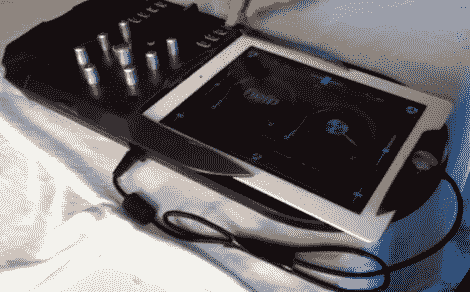

# IPad 2 在被黑的 IDJ 现场控制台上找到了家

> 原文：<https://hackaday.com/2011/11/11/ipad-2-gets-a-home-in-hacked-idj-live-console/>

[DJ FileSpnR] [在这个 IDJ 现场硬件上做了一些事情](http://touchtabletdj.blogspot.com/2011/10/modded-midi-controller-for-ipad2.html)为集成的 iPad 腾出空间。以前见过硬件的可能都认不出来。在库存条件下，控制器有两个转台致动器，它们之间有交叉推子控制。iPad 像一本书一样放在上面，使它成为一个相当笨重的装置。

在黑客攻击模式下，这款设备的移动性更强。物理转盘已被删除，中控台被移到一边。这留下了足够的空间来安装 iPad 2(最初的 iPad 可能太厚了，无法工作)。保留了原有转台挡板的一部分，以将 iPad 固定到位，同时保护基座连接器。现在触摸屏充当转盘控制，右边的物理滑块管理交叉淡入淡出。

休息后，看看 DJ 解释他的改变并演示完成项目的视频。

 <https://www.youtube.com/embed/h3xzU0R7jek?version=3&rel=1&showsearch=0&showinfo=1&iv_load_policy=1&fs=1&hl=en-US&autohide=2&wmode=transparent>

 </body> </html>