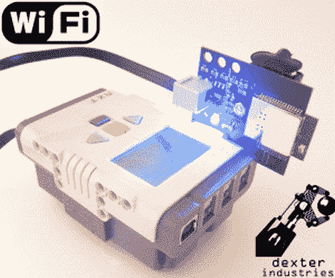

# 乐高 NXT 作品在船上安装了无线网络后更酷了

> 原文：<https://hackaday.com/2011/11/12/lego-nxt-creations-are-even-cooler-with-wifi-on-board/>

德克斯特工业公司的人刚刚结束了为期一周的乐高 NXT 项目，其中大部分都集中在他们的 NXT 无线传感器的使用上。在过去几个月的开发中，该团队一直在努力完善他们的设计，并解决一些问题，所以现在你也可以无线控制你的 NXT 作品了。

整个星期的演示涵盖了各种主题，首先是一个简短的教程，介绍如何使用 TCP 协议使用计算机与 NXT 设备进行通信。在了解了 WiFi 的节能功能后，他们开始 ping 其他联网的机器，并从 NXT 设备上查询 DNS 记录。名单上的下一个项目是基于 NXT 的网络服务器，以及通过互联网远程控制机器人。最后，他们通过[配置他们的乐高机器人来发送推文，结束了这一周。](http://dexterindustries.com/blog/2011/11/11/wifi-week-twitter-temperature/)

如果让你的 NXT 作品在移动中使用成熟的网络接入听起来很有趣，一定要去他们的网站下载，WiFi 手册等等。