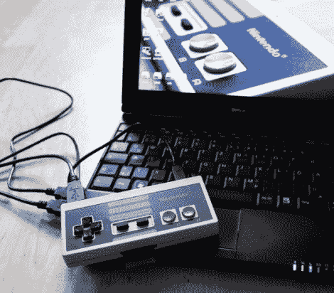

# NES 控制器是一种随身携带便携式操作系统的巧妙方式

> 原文：<https://hackaday.com/2011/11/13/nes-controller-is-a-slick-way-to-carry-around-your-portable-os/>

[Oliver]有一个旧的 NES 控制器，由于没有其他用途，他决定将它重新用作便携式存储设备。

他拆掉了控制器的大部分，去掉了塑料支架，留下了 D-pad 和其余的按钮完好无损。他在里面塞了一个 32 GB 的闪存盘，还有一个 SD 读卡器。他用 Dremel 在控制器上切了几个孔，一个用于闪存盘和 SD 卡读卡器的 USB 端口，一个用于 SD 卡本身。当物理修改完成后，他在闪存驱动器上安装了一个小的 Linux 发行版，它可以在任何支持从 USB 启动的 PC 上运行。

虽然有些人可能会争辩，但我们认为这是一个很好的方式来重新使用他可能会扔掉的旧游戏外设。便携式操作系统肯定会派上用场，尽管我们不能等到 [Raspberry Pi 完成](http://hackaday.com/2011/08/26/raspberry-pi-might-not-be-vaporware/)——如果有一台完整的计算机也装在里面，那就太棒了。