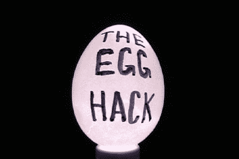

# 厨房窍门:[迪诺的]鸡蛋戏法

> 原文：<https://hackaday.com/2011/11/14/kitchen-hacks-dinos-egg-tricks/>

 

[Dino's]最新的每周黑客正好符合我们的厨房黑客主题。他正在分享一些关于鸡蛋的不为人知的技巧和诀窍。

他对使用鸡蛋略知一二也就不足为奇了。毕竟，他养鸡，你不能让好鸡蛋白白浪费掉。这就是他的第一条线索。鸡蛋可以保存几个星期，但是如果你不知道它们是否还是好的，你可以在打碎它们之前把它们放在一碗水里。漂浮的鸡蛋就要被淘汰了！

需要一些炒鸡蛋，但没有锅来煮它们？他的下一个壮举是用他的浓缩咖啡机上的蒸汽喷嘴做一份蒸鸡蛋早餐。它很乱(鸡蛋似乎飞得到处都是)，但最终产品看起来确实很开胃。

视频的其余部分(插播后)展示了他为本尼迪克特鸡蛋制作荷兰酱的方法，以及如何将鸡蛋壳的内部吹出来。

现在，我们脑海中浮现出这样一幅画面:迪诺的日常生活被鸡蛋包围着……就像《大人物拿破仑》中的蛋农一样。

 <https://www.youtube.com/embed/GGECFPmh6As?version=3&rel=1&showsearch=0&showinfo=1&iv_load_policy=1&fs=1&hl=en-US&autohide=2&wmode=transparent>

 </body> </html>