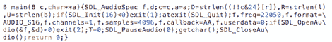

# 国际混淆 C 代码竞赛又回来了

> 原文：<https://hackaday.com/2011/11/14/the-international-obfuscated-c-code-contest-is-back/>

国际混淆 C 代码竞赛又回来了。IOCCC 的[声明的目标](http://www.ioccc.org/index.html#goals)是，“编写最晦涩的 C 程序，显示编程风格的重要性(通过做相反的事情)，强调预处理器到临界点，并说明 C 语言的一些微妙之处。”如果你认为你能够胜任滥用你的编译器的任务，检查一下竞赛的[规则](http://www.ioccc.org/2011/rules.txt)和[指南](http://www.ioccc.org/2011/guidelines.txt)。

没有什么比让飞行模拟器的[代码看起来像一架飞机，或者通过测量 C 代码的面积来计算圆周率更好的了。提交给 IOCCC 的是经典的黑客攻击；非常聪明的事情，不应该工作，但尽管他们自己。](http://www.ioccc.org/1998/banks.c)

自 2006 年以来就没有 IOCCC 比赛了，没人知道明年是否还会有。我们已经看到了今年的一些潜在条目，比如[将字符传送到/dev/audio](http://hackaday.com/2011/11/01/annoy-your-sound-guy-even-more/) 中以生成一首歌，以及[一直向下](http://hackaday.com/2011/07/12/zzstructure-emulator/)的超链接。如果你有正在做的东西，请随时[在](http://hackaday.com/contact-hack-a-day/)发送。

通过 [/。](http://developers.slashdot.org/story/11/11/13/1546218/the-ioccc-competition-is-back)