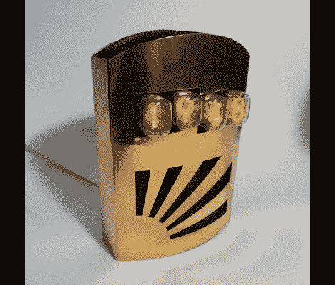

# 谢妮钟展示了制作精良的金属表圈

> 原文：<https://hackaday.com/2011/11/14/nixie-clock-exhibits-well-fabricated-metal-bezel/>

[Matt Evans]用他的谢妮钟赢得了冠军。他不仅有复古展示硬件的好处，而且他为它建造的围栏真的吸引了我们的眼球。

这个项目起源于他在一家旧货商店偶然发现了一套谢妮地铁。那是在 2007 年，他用手中的零件制造了高压驱动电路和控制板。这东西保持时间，但被安置在一个临时的箱子里，看起来有点粗糙。它坐在那里，等待再次成为他关注的焦点。

当最终需要建造一个合适的箱子时，Matt 从一小片回收的铜开始。他用手工制作了剪纸和折纸。他提到这有点不平衡。也许吧，但我们不认为这有损设计。一些黑屏(就像玄关门上使用的)覆盖了开口，给立面带来纹理和对比。

我们喜欢它的外观，ATmega48 带有用于 RTC 功能的时钟晶体，应该使它成为一个可靠的时间源。