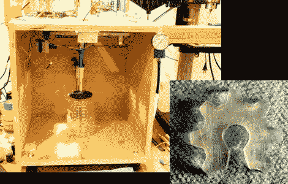

# 构建您自己的立体平版 3D 打印机

> 原文：<https://hackaday.com/2011/11/14/build-your-own-stereolithographic-3d-printer/>

[安迪的] 3D 打印机制造[使用激光从粘性物质中制造物体](http://www.instructables.com/id/Build-a-Laser-3D-Printer-Stereolithography-at-Ho/)。立体平版印刷工艺使用由紫外光固化的树脂来制造成品。安装在 CNC 台架上的单个激光器能够精确地瞄准树脂表面上的一点，开始印刷过程。随着层数的增加，安装在 Z 轴上的载物台慢慢沉入树脂槽中。所以基本上你是从下往上打印，但是激光不会上下移动。休息之后有一个时间压缩的视频，是一个嵌入打印的物体。它比我们所能描述的更好地说明了这个过程。

我们认为[Andy]真的全力以赴地撰写了构建过程。他的打印质量非常好，但你必须考虑与基于挤压的 3D 打印机相比的成本。一升他用来打印的紫外线树脂要花费 200 多美元。

如果这听起来很熟悉，那是因为当[我们看到他的 Delta 机器人作品](http://hackaday.com/2011/09/04/delta-robot-3d-printer/)时，我们已经先睹为快了。

 <https://www.youtube.com/embed/PV0BpoRTv38?version=3&rel=1&showsearch=0&showinfo=1&iv_load_policy=1&fs=1&hl=en-US&autohide=2&wmode=transparent>

 </body> </html>