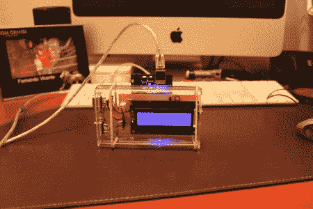

# 使用 Arduino 进行强力 BIOS 黑客攻击

> 原文：<https://hackaday.com/2011/11/16/brute-force-bios-hacking-using-the-arduino/>

这个聪明的黑客利用 Arduino 对计算机的 BIOS 进行暴力攻击。理论上，这种技术可以用于其他程序，但它的使用会受到限制，因为没有办法解释太多的错误密码。

Arduino 生成并输出模拟 USB 键盘的可能密码。完成后，读取屏幕中间的像素。这是通过读取与相应的水平和垂直脉冲同步的模拟红色信号来实现的。与任何黑客一样，有一些必须克服的编程问题(包括一个锁定键盘模拟器的问题)，但这已经解决了，如果您想构建自己的代码，代码是可用的。

这个构建的硬件很简单，包括一个 LCD 输出，一个停止一切的按钮，以及几个二极管来使 USB 键盘正常工作。这个黑客结果相当不错，代码和原理图都包括在内！