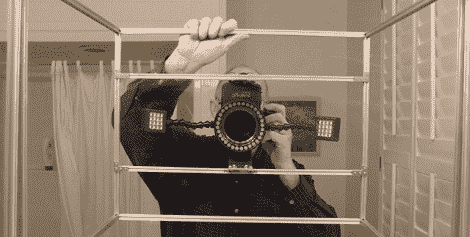

# 零重力实验会拍出一些漂亮的照片

> 原文：<https://hackaday.com/2011/11/16/zero-g-experiments-will-make-some-pretty-pictures/>

溜溜球在零重力下能用吗？纸飞机怎么样？这些问题在 1985 年的*发现号航天飞机上得到了解答，但是结果的再现是科学方法的基石。[罗布]即将重现一些令人敬畏的零重力照片，由[骑在一颗呕吐彗星](http://rjwoodhead.blogspot.com/2011/11/revised-high-speed-liquid-observation.html)上，拍摄一些水球碰撞的照片。*

在过去的几个月里，[Rob]有一张 G-Force One 的备用票，这是一架带乘客进行抛物线飞行以模拟微重力的飞机。他很幸运，因为他的备用票允许他在船上进行一些实验，所以[Rob]决定没有足够多的水在零重力下碰撞的精彩照片。

他用微型 t 型槽铝制成了一个装置。一个 DSLR 连同几个盛水的“试管”被安装在框架上。当[Rob]吹动管子时，会释放出一个小球体与其他物体碰撞。就当是书呆子版的[水花摄影](http://www.flickr.com/groups/530469@N22/)吧。

当然，如果没有更多的实验，零重力之旅是不完整的。[Rob]计划测试一些玩具，看看溜溜球在没有重力的情况下是否会“睡觉”(它们不会)，以及一个老爷钟是否能在月球上工作(有一个长达一个月的一天，所以有点)。一旦他回到地球，我们迫不及待地想看他的照片。