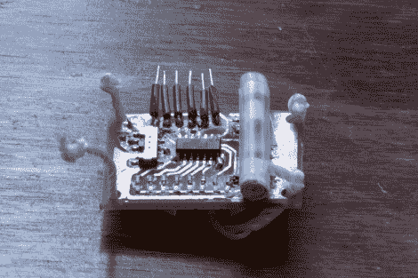

# POV Bauble 使用 DIY 加速度计来同步图像

> 原文：<https://hackaday.com/2011/11/16/pov-bauble-uses-diy-accelerometer-to-sync-the-image/>

因此，我们看到这个提示，并认为-哦，另一个视点设备。我们看了视频(休息后嵌入)，喝了一口咖啡，然后当我们意识到[这使用了一个 diy 传感器来同步 POV 图像](http://ch00ftech.com/2011/11/12/the-ice-breaker/)时，几乎将饮料喷得满电脑都是。

[Ch00f]在一个商业 POV 玩具上看到类似的实现后，产生了这个传感器的想法。这个玩具不是使用合适的加速度计来感知运动，而是在一个通道中使用一个塑料珠。当你移动玩具的身体时，珠子会滚动到一端或另一端，盖住或露出反射传感器。

这里使用了类似的传感器。一个吸管作为通道，一个纸包尼龙螺丝作为珠子。[Ch00f]在吸管底部切一个窗口，作为他的反射传感器，然后用一叠纸封住两端。

这种方法有效，但不如他希望的那么好。他使用的特定传感器的刷新率和计时似乎很差。如果换成一个简单的红外 LED 和光电晶体管(就像[Jack 的]上一个视频中的传感器)，他认为它会工作得更好。

via [Buildlounge](http://www.buildlounge.com/2011/11/16/the-icebreaker/) 。

 <https://www.youtube.com/embed/v_juUcHVYZo?version=3&rel=1&showsearch=0&showinfo=1&iv_load_policy=1&fs=1&hl=en-US&autohide=2&wmode=transparent>

 </body> </html>