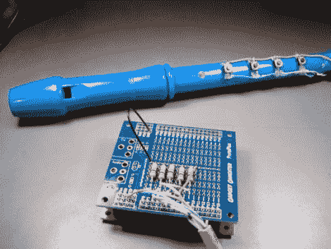

# 电子记录器转换

> 原文：<https://hackaday.com/2011/11/16/electronic-recorder-conversion/>

当我们为这个专题写标题时，我们可以明白为什么[杰夫·莱杰]称它为电子长笛而不是录音机；这是一种乐器，而不是用来存档音频的东西。抛开困惑不谈，我们都很熟悉这些塑料“乐器”。我们地区的许多小学要求学生购买一个作为音乐课的一部分。所以，如果你想自己尝试一下，应该不难找到一个(见鬼，[杰夫]拿了他的一元店)。

基本上，他用瞬时按键开关取代了手指孔，然后用[一个螺旋桨开发板将按键变成音乐](http://www.gadgetgangster.com/news/54/514)。这很简单也很快，但是我们用的是呼吸执行器。当然，你可以设置它在按钮被按下时播放，但是[Jeff]做了额外的努力，在底部增加了一个压电元件。当你吹气时，仪器会轻微弯曲，产生微控制器可以测量的微小电流。休息之后，请看短片。

再做一点工作，你就可以把它变成某种音乐游戏控制器。我们在想塞尔达！

 <https://www.youtube.com/embed/L8OU5mvgFHU?version=3&rel=1&showsearch=0&showinfo=1&iv_load_policy=1&fs=1&hl=en-US&autohide=2&wmode=transparent>

 </body> </html>