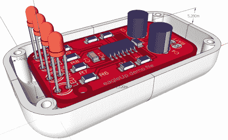

# EagleUp 把你的 PCB 放到 SketchUp 里

> 原文：<https://hackaday.com/2011/11/16/eagleup-pulls-your-pcbs-into-sketchup/>

[Karl]来信告诉我们一个名为 EagleUp 的软件包，它会将你的 Eagle CAD PCB 设计导入到 Google SketchUp 中。它使用[开源图像处理软件 ImageMagick](http://www.imagemagick.org/script/index.php) 在两者之间架起了一座桥梁。

正如你在上面看到的，你将得到一个漂亮的硬件 3D 模型。这是一个很好的方法，可以确保你的外壳设计能够正常工作，而不需要等待 PCB 从工厂到达。它适用于 Windows、OSX 和 Linux(尽管上次我们试图在 Wine 下运行 Sketchup 时没有什么好结果——也许是时候再试一次了)。

在[Karl]的例子中，他正在开发一个基于 Xmega 的 Arduino 兼容板。他提到，EagleUp 是一种很好的方式，可以了解元件布局的最终结果，并了解丝网层的效果是否良好。这是他的一个测试设计的链接。