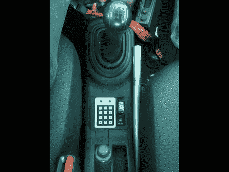

# 为汽车点火系统增加键盘安全性

> 原文：<https://hackaday.com/2011/11/17/adding-keypad-security-to-your-automobiles-ignition-system/>

[BadWolf]设法腾出一些空闲时间回到他自己的电子项目上。这一次，他为自己的汽车设计了一套安全系统。它嵌在点火装置上，防止钥匙转动时发动机启动。司机必须先插入钥匙，然后在中控台的键盘上输入密码，汽车才会启动。

当他在做这个项目的时候，他还决定在仪表板上添加一个启动按钮(我们认为这确实使它看起来像一个后来的模型车辆)。键盘由 Arduino Nano 驱动，其中存储了启动代码。该系统的电源由隐藏在仪表板后面的 USB 集线器提供，他认为这在未来的黑客攻击中也会派上用场。

输入正确的密码后，你会听到超级马里奥兄弟主题的重现。每次按键时，扬声器还会发出悦耳的嘟嘟声。休息后观看演示片段，亲自聆听。

[https://www.youtube.com/embed/tHOID4QQ3vg?version=3&rel=1&showsearch=0&showinfo=1&iv_load_policy=1&fs=1&hl=en-US&autohide=2&wmode=transparent](https://www.youtube.com/embed/tHOID4QQ3vg?version=3&rel=1&showsearch=0&showinfo=1&iv_load_policy=1&fs=1&hl=en-US&autohide=2&wmode=transparent)