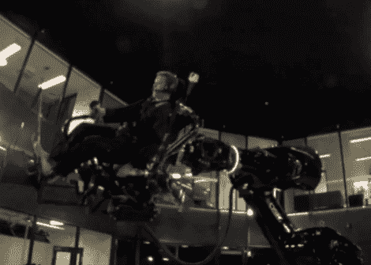

# 系好安全带，让这个机器人手臂把你摇醒

> 原文：<https://hackaday.com/2011/11/19/strap-yourself-in-and-let-this-robot-arm-shake-the-bejesus-out-of-you/>

这个人被绑在一个巨大机械臂的商业端。如果你看过汽车装配线上的工业机器人之类的视频，你就会知道这些机器有多快多强。但这并不是为了工厂车间，而是为了训练澳大利亚战斗机飞行员而建造的新型飞行模拟器。

迪肯大学的研究人员正在寻找一种方法，给战斗机飞行员一个更真实的模拟器体验。他们最终得到的是一个可以在两个轴上连续旋转的装置。这让飞行员感受到失速和飞机失控的感觉。

休息后的视频不容错过。你会看到试飞员(读作:豚鼠)被抛来抛去，以至于我们几乎认定这应该是[一个“真的或假的”帖子](http://hackaday.com/2011/07/27/camera-flash-marquee-real-of-fake/)。但是我们相信这确实存在。我们预计未来的版本将包括飞机的前部，并完全封闭在一个投影穹顶内，就像雷克萨斯驾驶模拟器一样[。](http://hackaday.com/2010/10/24/hackaday-links-october-24-2010/)

[https://www.youtube.com/embed/SkjEOO1rM9A?version=3&rel=1&showsearch=0&showinfo=1&iv_load_policy=1&fs=1&hl=en-US&autohide=2&wmode=transparent](https://www.youtube.com/embed/SkjEOO1rM9A?version=3&rel=1&showsearch=0&showinfo=1&iv_load_policy=1&fs=1&hl=en-US&autohide=2&wmode=transparent)