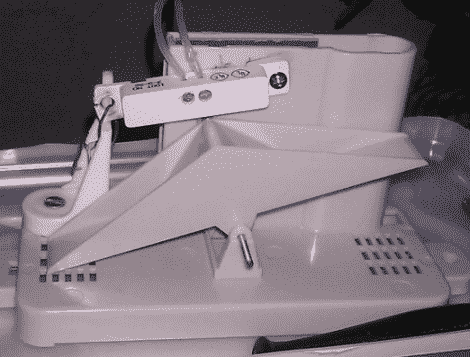

# Python 动力洒水系统不浪费水

> 原文：<https://hackaday.com/2011/11/19/python-powered-sprinkler-system-wastes-no-water/>

有一件事让贾舒亚非常恼火，那就是在半夜听到他的自动喷水灭火系统启动，而那天早些时候刚下过雨。他希望他的洒水器更智能一点，所以他决定升级系统。

他没有花几百美元去买一个更复杂的自动化系统，而是花了 45 美元买了一些用品，并收集了一些他放在家里的东西，自己做了一个雨水感应模块。

由此产生的项目 Pysprinklers 使用 Python 和一些组件来更好地管理他的用水。他得到了一个便宜的雨量计，并用一个游戏控制器和一组磁性表面触点对其进行了改造。如果在过去的 24 小时内有大量的降雨，他的系统会阻止洒水装置开启。此外，如果天气预报有雨，洒水装置会延迟一点，看看雨是否会进入该地区。

我们都支持省钱(和节水)，所以我们认为[Jashua 的]系统看起来很棒，特别是因为他最终使用了手头已经有的一些东西。