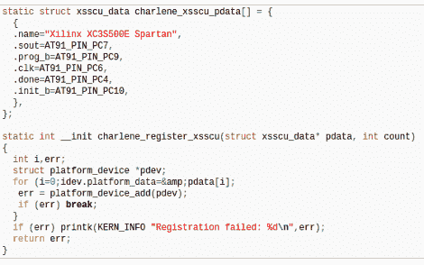

# 使用“cat”通过串行推送 FPGA 配置文件

> 原文：<https://hackaday.com/2011/11/19/pushing-fpga-config-files-via-serial-using-cat/>

[Andrew]正在努力完成他的博士项目，但他对 FPGA/ARM 开发板的配置选项的糟糕状态感到惊讶。使用 JTAG 非常慢，所以他研究了数据表，看看是否有其他方法。原来他使用的 Xilinx FPGA 确实有从机串行模式，所以他想出了一种方法[将配置从 ARM 串行推送到 FPGA](http://necromant.ath.cx/wp/2011/11/18/configuring-a-xilinx-fpga-from-arm/)。

他需要的四个连接已经映射到 AT91SAM9260 ARM 片上系统的 PortC 引脚。他最终使用 FPGA 上的 EN_GSM 引脚，因为该板上没有 GSM 模块；用一根电线把它连接到微控制器上。现在，他可以 SSH 到 ARM 处理器，从/dev/fpga0 获取 FPGA 上的信息。到了编程的时候，就像在二进制文件上使用 cat 命令并将输出重定向到同一个钩子一样简单。