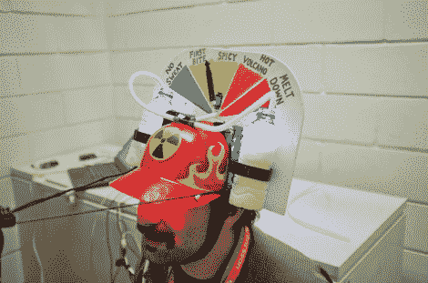

# 核玉米卷头盔测量对辛辣食物的反应

> 原文：<https://hackaday.com/2011/11/19/nuclear-taco-helmet-measures-reaction-to-spicy-food/>

显然，在 2010 年 Codebits 会议上有一场核玉米卷吃比赛。来自里斯本黑客空间 altLab 的团队没有参与，但那些参与的人的不适深深印在了他们的记忆中。今年， [altLab 成员决定制作一个 spciy taco 监控头盔](http://altlab.org/2011/11/17/nuclear-taco-sensor-helmet-gameshow/)，作为大会 48 小时黑客竞赛的一部分。

头盔的灵感来自那些啤酒头盔，让你通过一根分叉的吸管吸下两个头戴式冷头盔。在这种情况下，啤酒已经被瓶装牛奶取代，以帮助熄灭你燃烧的 piehole。但是如果你真的喝了一小口，观察者会知道，因为流量传感器会测量你喝了多少。还有一个湿度传感器，可以监测你额头上积聚的汗水。运行它的 Arduino 会跟踪这些信息，并使用它来设置头盔顶部的不适测量仪，同时观众可以从头盔边缘以外的摄像头获得特写镜头。

我们很高兴地说，他们赢得了创作第一名。休息之后看看他们 90 秒的展示。

<https://player.vimeo.com/video/32030833>

 </body> </html>