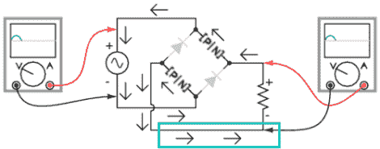

# 交流到直流电源转换的桥式整流器试验

> 原文：<https://hackaday.com/2011/11/20/experimenting-with-bridge-rectifers-for-ac-to-dc-power-conversion/>

玩具制造商电视台的人又制作了一集。这次[他们将着眼于桥式整流器](http://tymkrs.tumblr.com/post/12971791117/diy-bridge-rectifier-iii-how-to-make-an-ac-power)以及它们如何用于交流到 DC 转换器。

这是一个简单的概念，对于不熟悉它的人来说，值得花时间去学习。因为交流电是由正负信号的周期组成的，所以在用于直流电路之前必须进行转换；这一过程称为整改。这是通过一系列单向门(二极管)实现的，其布局被称为桥式整流器。这就是上图中看到的菱形。

这一集是在休息之后嵌入的，对这个概念进行了长时间的审视。我们最喜欢这个演示的一点是，节目的主持人谈论了真实的电子流。对于那些对电子学不熟悉的人来说，这总是一个泥潭，因为示意图描绘了从正到负的流动，但是电子理论表明实际的电子流是完全相反的。 <https://www.youtube.com/embed/ixthQcMcguo?version=3&rel=1&showsearch=0&showinfo=1&iv_load_policy=1&fs=1&hl=en-US&autohide=2&wmode=transparent>

 </body> </html>