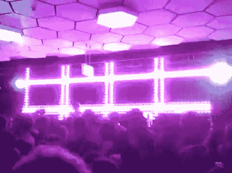

# 这个巨大的手工制作的 LED 矩阵一定是我们的！

> 原文：<https://hackaday.com/2011/11/20/this-giant-hand-made-led-matrix-must-be-ours/>

[Martin]来信分享了他的公司已经进行了一段时间的一个项目，一面巨大的 1470 像素 LED 墙。该集团为俱乐部、派对等提供照明，他们手工打造的 LED 矩阵肯定会成为展会的亮点。

这个神奇的矩阵是在[马丁的]起居室里从头开始设计并手工建造的。他们设计了小型 32x32mm“像素”板，每个板都有 6 个 PLCC6 RGB LEDs，由单个 WS2801 LED 控制器驱动。多氯联苯是手工组装的，每一个都在[马丁]拥有的一个小型比萨饼烤箱中回流。像素完成后，它们被连接到铝条上，组合成 30 个 70×70 厘米的框架，连接在一起形成一个巨大的矩阵。

你可以在下面的视频集中看到，显示效果非常令人印象深刻。我们只是希望他们将被迫发布其电路板的原理图，以便我们可以在办公室中构建一个这样的电路板。

 <https://www.youtube.com/embed/zrdvFy05Tdg?version=3&rel=1&showsearch=0&showinfo=1&iv_load_policy=1&fs=1&hl=en-US&autohide=2&wmode=transparent>

 <iframe class="youtube-player" width="800" height="480" src="https://www.youtube.com/embed/cWWXF2-wJII?version=3&amp;rel=1&amp;showsearch=0&amp;showinfo=1&amp;iv_load_policy=1&amp;fs=1&amp;hl=en-US&amp;autohide=2&amp;wmode=transparent" allowfullscreen="true" style="border:0;" sandbox="allow-scripts allow-same-origin allow-popups allow-presentation"/> <iframe class="youtube-player" width="800" height="480" src="https://www.youtube.com/embed/2dj24dXLCZo?version=3&amp;rel=1&amp;showsearch=0&amp;showinfo=1&amp;iv_load_policy=1&amp;fs=1&amp;hl=en-US&amp;autohide=2&amp;wmode=transparent" allowfullscreen="true" style="border:0;" sandbox="allow-scripts allow-same-origin allow-popups allow-presentation"/> <iframe class="youtube-player" width="800" height="480" src="https://www.youtube.com/embed/Bhqpj-Pp578?version=3&amp;rel=1&amp;showsearch=0&amp;showinfo=1&amp;iv_load_policy=1&amp;fs=1&amp;hl=en-US&amp;autohide=2&amp;wmode=transparent" allowfullscreen="true" style="border:0;" sandbox="allow-scripts allow-same-origin allow-popups allow-presentation"/> <iframe class="youtube-player" width="800" height="480" src="https://www.youtube.com/embed/d5hJmRaaKnA?version=3&amp;rel=1&amp;showsearch=0&amp;showinfo=1&amp;iv_load_policy=1&amp;fs=1&amp;hl=en-US&amp;autohide=2&amp;wmode=transparent" allowfullscreen="true" style="border:0;" sandbox="allow-scripts allow-same-origin allow-popups allow-presentation"/> <iframe class="youtube-player" width="800" height="480" src="https://www.youtube.com/embed/4qrvVyCgJgo?version=3&amp;rel=1&amp;showsearch=0&amp;showinfo=1&amp;iv_load_policy=1&amp;fs=1&amp;hl=en-US&amp;autohide=2&amp;wmode=transparent" allowfullscreen="true" style="border:0;" sandbox="allow-scripts allow-same-origin allow-popups allow-presentation"/> <iframe class="youtube-player" width="800" height="480" src="https://www.youtube.com/embed/0I3MqnNIKs4?version=3&amp;rel=1&amp;showsearch=0&amp;showinfo=1&amp;iv_load_policy=1&amp;fs=1&amp;hl=en-US&amp;autohide=2&amp;wmode=transparent" allowfullscreen="true" style="border:0;" sandbox="allow-scripts allow-same-origin allow-popups allow-presentation"/> <iframe class="youtube-player" width="800" height="480" src="https://www.youtube.com/embed/BGxosU7IRzM?version=3&amp;rel=1&amp;showsearch=0&amp;showinfo=1&amp;iv_load_policy=1&amp;fs=1&amp;hl=en-US&amp;autohide=2&amp;wmode=transparent" allowfullscreen="true" style="border:0;" sandbox="allow-scripts allow-same-origin allow-popups allow-presentation"/> </body> </html>