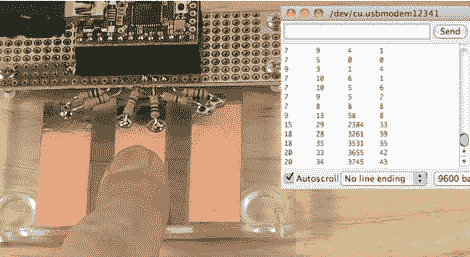

# 带有 Arduino CapSense 库的简单触摸传感器

> 原文：<https://hackaday.com/2011/11/21/simple-touch-sensors-with-the-arduino-capsense-library/>

有没有想过在你的项目中使用触摸传感器，但因为工作量太大而没有这样做？[Paul Stoffregen]证明了如果你为 Arduino 使用 CapSense 库的话，事情会变得非常简单。在这里，他创造了三个触摸传感器，用两个电阻将它们连接到 Teensy 微控制器。较大的电阻(这里看起来像 4.7 兆欧)通过铜焊盘发送信号，由次级引脚读取。这里，该引脚通过 1k 电阻防止静电放电。微控制器通过测量输入引脚上的电压变化所需的时间来读取读数。

由于 CapSense 库负责这些读数的计时，所以您所要做的就是决定您的程序将如何对即将到来的数字做出反应。在休息后的视频中，[Paul]通过串行监视器回显计时数据，以了解数据的样子。他实验直接触摸铜，并通过一块透明胶带触摸它。

我们之前在[这个互动展品](http://hackaday.com/2011/04/29/the-start-to-finish-of-an-interactive-exhibit/)中见过[正在工作的 CapSense 库](http://www.arduino.cc/playground/Main/CapSense)。

 <https://www.youtube.com/embed/BHQPqQ_5ulc?version=3&rel=1&showsearch=0&showinfo=1&iv_load_policy=1&fs=1&hl=en-US&autohide=2&wmode=transparent>

 </body> </html>