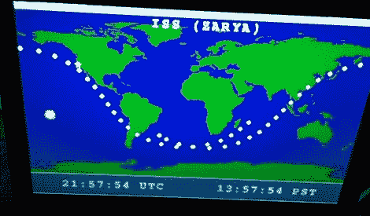

# 用 Arduino 追踪卫星

> 原文：<https://hackaday.com/2011/11/21/tracking-satellites-with-an-arduino/>

brainwagon 的人刚刚完成了 ANGST，Arduino n' Gameduinio 卫星跟踪器，它可以在任何 SVGA 监视器上显示地球轨道上的 160 颗不同的卫星。

这个建筑当然是基于 Arduino 和 [Gameduino](http://excamera.com/sphinx/gameduino/) 盾。卫星跟踪器总是需要一个实时时钟，因此需要一个 DS1307 RTC。卫星数据存储在一个 128KB 的 EEPROM 中，这个容量足够容纳 750 颗不同的卫星和轨道。

软件方面的事情有点棘手。brainwagon 公司的人使用[詹姆斯·米勒]非常受欢迎且非常老派的 PLAN-13sat 追踪软件。这个轨道计算程序发表于 1983 年，此后从 BBC Basic 移植到几乎所有可以想象的系统。

一旦“焦虑”接通电源，它就会读取实时时钟并计算出卫星的位置。这是实时完成的，每三分钟更新一次。在屏幕上，最后一个轨道(以及稍多一点)与太阳和焦虑的位置一起显示。你可能不会在北美防空联合司令部的太空司令部发现类似的焦虑，但我们想不出更好的方法来跟踪我们头顶上的[立方体卫星](http://hackaday.com/2011/10/11/send-a-satellite-into-space-for-300/)和[间谍卫星](http://hackaday.com/2011/06/21/photographing-near-space-objects-were-not-supposed-to-know-about/)。

[https://www.youtube.com/embed/TgfEjxYKYZw?version=3&rel=1&showsearch=0&showinfo=1&iv_load_policy=1&fs=1&hl=en-US&autohide=2&wmode=transparent](https://www.youtube.com/embed/TgfEjxYKYZw?version=3&rel=1&showsearch=0&showinfo=1&iv_load_policy=1&fs=1&hl=en-US&autohide=2&wmode=transparent)