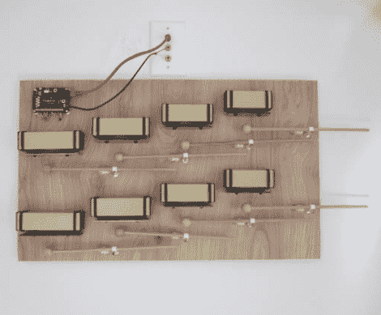

# 赏心悦目的门铃

> 原文：<https://hackaday.com/2011/11/22/a-doorbell-pleasing-to-both-the-ears-and-eyes/>

当[大卫]搬进他的新居时，他注意到的一件事是他的门铃相当差劲。他的新无线固态门铃来自一个装有螺线管和门铃的家庭，听起来很可怕。

除了糟糕的声音，门铃几乎从来没有正常工作过，但是唉，其他项目突然出现，几年后[大卫]才解决他的门铃问题。像许多需要很长时间才能实现的事情一样，我们认为他的基于谐振钟的解决方案非常值得等待。

他的主要目标之一是做一个听起来不错的门铃，看起来也很棒。他把一个儿童共鸣钟玩具安装在一张木头上，为这项工作创造了他自己的木槌。他最初很难找到门铃的致动器，但在 Make 的另一个木琴黑客中找到了齿轮传呼机电机的解决方案。硬件搞定后，他把注意力集中在电子设备上，这包括一对 Arduino 克隆体——一个在显示器上，一个在地下室。

留下来看看[大卫的] Campanello 门铃在运行，如果这听起来像是你想在家里拥有的东西，一定要查看他的网站以了解更多细节。

[通过[使](http://blog.makezine.com/archive/2011/11/programmable-diatonic-doorbell-chimes.html)

[vimeo http://vimeo.com/23187397 w=470]