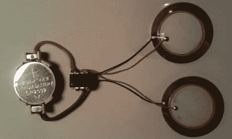

# 零件最少的音乐贺卡

> 原文：<https://hackaday.com/2011/11/22/musical-greeting-card-with-minimal-parts/>

我们都熟悉那些音乐贺卡。给霍尔马克商店 10 美元，你就有一张内置微控制器的卡，可以播放几首歌曲中的一首。[Jarv]之前在用 Arduino 将 MIDI 音轨翻译成方波歌曲，所以他决定看看他能以多低的成本复制这些音乐卡。由此产生的结构让他可以把任何他想要的歌曲放在他的卡片上，而且比霍尔马克公司提供的价格更低。

电路非常小——只有一个 ATtiny 85、一个电池座和两个用于双声和声的压电扬声器。焊接完电池和扬声器后，[Jarv]需要一种方法将音乐存储在他的芯片上。为此，他使用了 [MuseScore](http://musescore.org/) ，这是一个音乐符号程序，允许【Jarv】将多种声音融合在一起。

一旦乐谱被清理干净，[Jarv]就使用他的 [XML2H Python 脚本](https://github.com/jarv/PlayTune/blob/master/bin/xml2h.py)来获取 MIDI 数据，并分析出频率和延迟。最终，[Jarv]在贺卡上花了不到 5 美元——几乎便宜到可以开始考虑用音乐投掷物来补充我们窗户上闪烁的电池、led 和磁铁。

休息后，请观看视频，听听[Jarv]的电路播放《玩具总动员》中的主题。

 <https://www.youtube.com/embed/gntKQZFomi8?version=3&rel=1&showsearch=0&showinfo=1&iv_load_policy=1&fs=1&hl=en-US&autohide=2&wmode=transparent>

 </body> </html>