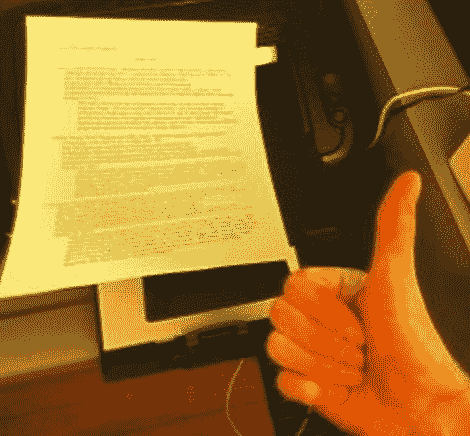

# 当您的打印机拒绝打印时，简单的低碳粉解决方案可以挤出几页多余的页面

> 原文：<https://hackaday.com/2011/11/22/simple-low-toner-workaround-squeezes-out-a-few-extra-pages-when-your-printer-refuses/>

[Andrew]正准备打印一份作业，他的三星打印机突然开始向他闪烁红色错误灯。由于找不到任何解释该问题的文档，他直接打电话给三星，发现它显示碳粉盒快空了。

他按下打印测试页的按钮，尽管打印机坚持说没有足够的墨粉，但打印出来的页面还是很好。他觉得三星试图强迫他购买另一个昂贵的碳粉盒，对此他很恼火，于是他寻找一种绕过限制的方法。

他发现他的打印机软件允许他指定自定义测试页文档，尽管它要求文档是 PostScript 格式。在几个 shell 命令之后，他转换了他的文档，并开始做更大更好的事情。

虽然有点费时间，但他的解决方法应该能让他用这个碳粉盒至少多活一会儿。我们认为，既然他使用的是 Linux，那么这个过程很可能是脚本化的，以节省时间，尽管我们不确定这是否也适用于基于 Windows 的个人电脑。