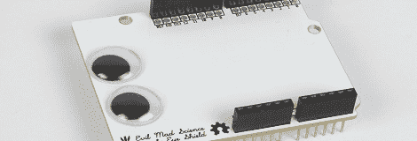
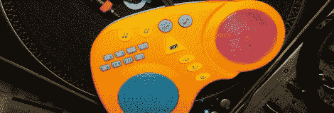
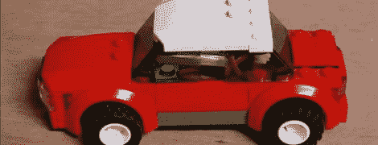

# 黑客日链接:2011 年 11 月 24 日

> 原文：<https://hackaday.com/2011/11/24/hackaday-links-november-24-2011/>

#### 最后一个 Arduino 盾牌什么也没做

邪恶疯狂科学家实验室的人们终于为 Arduinos 创造了[谷歌眼罩](http://www.evilmadscientist.com/article.php/googlyshield)。通过它的直通. 100 头，它增加了你的 Arduino 项目的眼睛。当然，~~代替~~除了眼睛，你还可以加一块试验板，让它有点用处。第一个在这个东西上实现 Xeyes 的人将获得 100 万个假互联网积分。

#### 来自儿童玩具的节拍

[Ville]买不起一个 Akai MPC 放一些节拍。想要一个真实的触觉界面，他黑了这个孩子的玩具。这只是一个 RCA 电缆连接到玩具内部的微型芯片。新的路线去了他的搅拌机，在那里他做了一些非常令人印象深刻的东西。

#### 蒙娜丽莎是喀尔巴阡山脉的维果

关于现实生活中的 Xeyes 我们刚刚说了什么？[Geert]刚刚印了一张蒙娜丽莎的照片，用她的眼睛跟着你在房间里走[(荷兰语，](http://geertvw.blogspot.com/2011/11/mona-lisa.html)[翻译](http://translate.google.com/translate?sl=nl&tl=en&js=n&prev=_t&hl=en&ie=UTF-8&layout=2&eotf=1&u=http%3A%2F%2Fgeertvw.blogspot.com%2F2011%2F11%2Fmona-lisa.html&act=url))。构建是一对伺服系统和一个在笔记本电脑上运行的 DIY 动作捕捉应用程序。现在我们需要找到维果的指纹…

#### 量化散热器效率

[迈克]本质上是一个实验者。他想知道小型夹式散热器与我们用来解冻冷冻食品的散热器相比的效率。[结果](http://grieg.gotdns.com/blog/?p=697)完全如你所料，但他确实发现了一些有趣的东西——他的实验技术没有发现导热膏/油脂/衬垫和没有导热材料之间有多大区别。

#### 迷你无花果大小的遥控乐高汽车

Brickmodder.net 公司的人从乐高玩具中取出一辆汽车，然后[让它遥控](http://www.youtube.com/watch?feature=player_embedded&v=Ae_sQO5fqsQ)。传动系统和转向系统都使用由他们能找到的最小的三通道接收器控制的伺服系统。