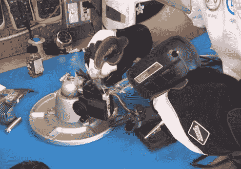

# 更换焊片电池

> 原文：<https://hackaday.com/2011/11/26/replacing-solder-tab-batteries/>

市面上有很多内置电池的设备，但大多数人从未想过这一点。这是因为他们使用密封在内部的可充电电池，并使用外部充电器充电。[托德·哈里森]有几个，包括一个无绳剃须刀和一个圣诞灯定时器。这些东西他已经用了好几年了，电池已经坏了。它们不应该是消费者可更换的，但这确实阻止了他自己拆开它们并更换焊片电池。

电池本身并不那么难找到。剃须刀只需一节镍氢 AA 电池。但是因为它们不能被替换，[托德]需要做一些焊接。在这里，你可以看到他正在使用焊枪在新电池和其中一个焊片之间建立连接。他用枪而不是熨斗，因为他需要快速加热接头，并且必须避免加热电池的其余部分，否则会破裂。为了安全起见，他戴着手套和全面罩。

休息后查看视频以了解这一点，以及照明控制器中的硬币电池更换。

[https://www.youtube.com/embed/xVS4U-LZBiY?version=3&rel=1&showsearch=0&showinfo=1&iv_load_policy=1&fs=1&hl=en-US&autohide=2&wmode=transparent](https://www.youtube.com/embed/xVS4U-LZBiY?version=3&rel=1&showsearch=0&showinfo=1&iv_load_policy=1&fs=1&hl=en-US&autohide=2&wmode=transparent)