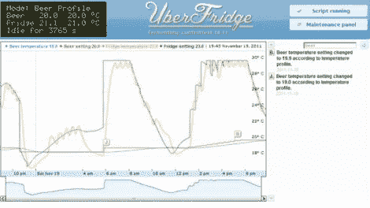

# Beer 冰箱有助于啤酒生产度过三伏天

> 原文：<https://hackaday.com/2011/11/24/uberfridge-helps-keep-beer-production-going-through-the-dog-days-of-summer/>

[Elco Jacobs]过去常常让他的啤酒在厨房里发酵，但当夏天太热时，他不得不暂停啤酒酿造几个月。他不想再次中断生产，于是将一台旧冰箱改造成一个他称之为超级冰箱的可怕的发酵装置。

冰箱有两个温度传感器，一个位于发酵的啤酒中，另一个测量冰箱的温度。这种双探头设置为他提供了密切监控发酵过程的能力，他通过一个外观锐利的网络界面进行监控。

Arduino 充当 PID 控制器，通过串行连接与无线路由器通信。Arduino 记录数据并将数据转发到路由器，在路由器上可以通过网络浏览器查看数据。他不仅可以监视冰箱里发生的事情，还可以通过网络界面对 Arduino 重新编程。

继续阅读，看看[Elco]如何解释他的超级冰箱的来龙去脉——我们很肯定你会想在你做了之后自己做一个。

[通过 [BuildLounge](http://www.buildlounge.com/2011/11/22/the-uberfridge/)

 <https://www.youtube.com/embed/sxxIpv2lsyw?version=3&rel=1&showsearch=0&showinfo=1&iv_load_policy=1&fs=1&hl=en-US&autohide=2&wmode=transparent>

 </body> </html>