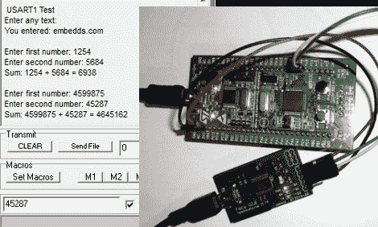

# ARM 编程入门；让 USART 运行起来

> 原文：<https://hackaday.com/2011/11/26/arm-programming-primer-getting-the-usart-running/>

我们发现有趣的是，PIC 和 AVR 编程在 hobby electronics 中非常常见，但 ARM 几乎没有相同的立足点。这部分是因为这种转变存在知识障碍(另一部分可能是缺乏 DIP 封装芯片)。但是如果你使用过 8 位微控制器，你肯定可以跳到 32 位领域。这是一个尝试的好机会。本指南将向您展示如何[在 STM32 Discovery Board 上获得 USART 工作](http://www.embedds.com/programming-stm32-usart-using-gcc-tools-part-1/)，从而轻松获得关于您的项目进展情况的反馈。

迁移到 ARM 微控制器时，您会注意到一个不同之处，即制造商几乎总是提供一个库包，其中包含硬件控制所需的所有功能(USART、USB、以太网、ADC 等)。).这里就是这种情况，所以简单地包含 USART 库就可以轻松完成程序的其余部分。一旦连接上通信硬件(在本例中是 FTDI 电缆),只需使用库初始化函数，然后是发送和接收命令，您就可以立即将消息推送到计算机终端。

如果你想在 Linux 系统上使用 STM32 发现板，这里有一个正确的方向。