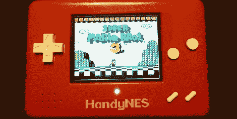

# 可爱小巧的便携式 NES

> 原文：<https://hackaday.com/2011/11/27/adorable-and-small-portable-nes/>

邦多女王又回来了，这一次是带着可爱小巧的 NES 便携式车 HandyNES。

上次见到[lovablechevy]时，她刚刚完成了她的任天堂的制作，这个制作把 NES 和 SNES 塞进了一个盒子里。任天堂是一个如此干净的产品，浪费她的才华是一种犯罪，所以[Lovablechevy]完成了我们见过的最小的 NES 便携式电脑之一。

该版本基于一款 3.5 英寸屏幕的顶装式 NES。[rekarp]的 [NES2 复合模式](http://longhornengineer.com/2011/07/19/nes-2-video-mod-schematic/)被用来让 NES 和屏幕一起工作。两节锂离子电池提供 3 小时的游戏时间(带一个[低电量指示灯](http://forums.benheck.com/viewtopic.php?f=43&t=38200)，当然)。

[lovablechevy]还包括一个 AV 输出，这样她就可以将她的手连接到更大的 CRT 屏幕上。就像我们以前的 [Sega Nomad](http://en.wikipedia.org/wiki/Sega_Nomad) 一样，这允许一个小小的双人动作——一号玩家使用手柄，二号玩家使用额外的控制器。在将 Zapper 连接到 USB 端口后，还包括了对 Zapper 的支持。

休息之后，请观看视频演示。为了证明她的版本不是克隆的，[lovablechevy]还加入了一段她自己扮演*战斗蟾蜍*越过克隆崩溃点的视频。邦多女王的杰作。

 <https://www.youtube.com/embed/TBQk3E_tEWc?version=3&rel=1&showsearch=0&showinfo=1&iv_load_policy=1&fs=1&hl=en-US&autohide=2&wmode=transparent>

 <iframe class="youtube-player" width="800" height="480" src="https://www.youtube.com/embed/KI_iek6mNfk?version=3&amp;rel=1&amp;showsearch=0&amp;showinfo=1&amp;iv_load_policy=1&amp;fs=1&amp;hl=en-US&amp;autohide=2&amp;wmode=transparent" allowfullscreen="true" style="border:0;" sandbox="allow-scripts allow-same-origin allow-popups allow-presentation"/> </body> </html>