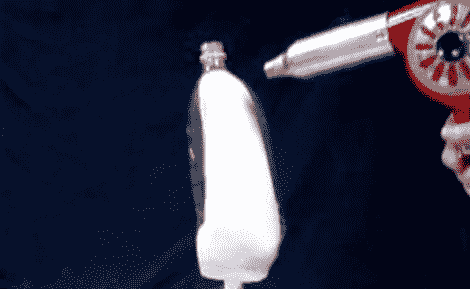

# 从 DIY 假肢建造者那里学习新的制作技术

> 原文：<https://hackaday.com/2011/11/28/learn-a-new-fabrication-technique-from-diy-prosthetics-builders/>

这是一个视频教程的截图，这个视频是关于[用 2 升的汽水瓶制作自己的假肢部件](http://www.youtube.com/watch?v=Yvev6shNvSg)。不透明的白色部分是石膏做的模具。这是佩戴者肢体的代表，为这种制造技术提供了必要的坚硬、耐热的形式。你可以看到一个透明的塑料汽水瓶，当底部被移除后，它正好盖在模板上。热风枪使塑料收缩成石膏模型的形状。

一旦成型，带螺纹的颈部用带锯从中间分开。这将接收一段 1/2”PVC 管，通过颈部和管夹固定到位。这是可能的，但第二个视频详细介绍了一个额外的瓶子，用于使设备更加刚性。休息之后看两个视频。

这种制造工艺针对的是世界上无法获得先进假肢的地区。我们认为这是一个很好的展示，展示了我们可以做些什么来改善截肢者的生活。我们也认为这是一种可以在其他项目中使用的技术……我们只是还没有弄清楚这些是什么。

如果你用心去做，这种塑料垃圾的用途是惊人的。

[https://www.youtube.com/embed/Yvev6shNvSg?version=3&rel=1&showsearch=0&showinfo=1&iv_load_policy=1&fs=1&hl=en-US&autohide=2&wmode=transparent](https://www.youtube.com/embed/Yvev6shNvSg?version=3&rel=1&showsearch=0&showinfo=1&iv_load_policy=1&fs=1&hl=en-US&autohide=2&wmode=transparent)

[https://www.youtube.com/embed/EFdgrJ-kyTE*w=470?version=3&rel=1&showsearch=0&showinfo=1&iv_load_policy=1&fs=1&hl=en-US&autohide=2&wmode=transparent](https://www.youtube.com/embed/EFdgrJ-kyTE*w=470?version=3&rel=1&showsearch=0&showinfo=1&iv_load_policy=1&fs=1&hl=en-US&autohide=2&wmode=transparent)

[谢谢克里斯]