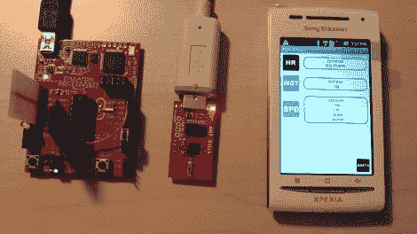

# 使用 MSP430 芯片和 Android 手机的 ANT+网络

> 原文：<https://hackaday.com/2011/11/28/ant-networks-using-an-msp430-chip-and-android-phone/>

[Jbremnant]想尝试一下 ANT+无线网络。该协议专为重量轻、功耗低的消费电子产品设计，如心率胸带和自行车电脑(例如 Garmin 品牌的设备)。已经有了 Arduino 的库，但是[Jbremnant]发现它们中的大部分都是作为从属代码编写的。他开始使用 MSP430 来驱动一个全功能的蚂蚁网络，包括一台电脑和一部安卓手机。

TI Launchpad 用作网络中的主节点。[Jbremnant]选择了开发平台附带的两个 MSP430 处理器中较小的一个。沿着这条路走下去后，他意识到芯片没有与 SparkFun ANT 板(基于 nRF24AP1 无线电芯片)通信所需的硬件 UART。他使用了以前用过的软件 UART。现在他可以从发射台传输测试数据了。它被他电脑上的 USB 加密狗和上面看到的安卓手机接收到。休息之后看看他的演示视频。

 <https://www.youtube.com/embed/ck9I86ENKLI?version=3&rel=1&showsearch=0&showinfo=1&iv_load_policy=1&fs=1&hl=en-US&autohide=2&wmode=transparent>

 </body> </html>