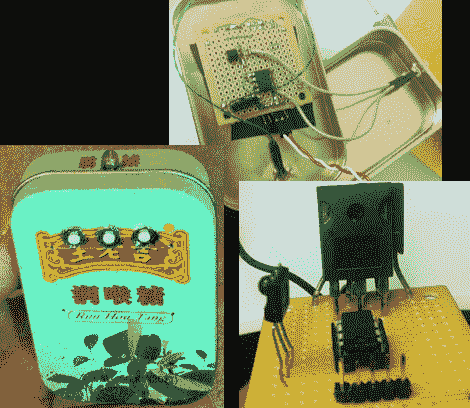

# 灯变暗和懒人遥控

> 原文：<https://hackaday.com/2011/11/29/lamp-fading-and-remote-control-for-the-lazy/>

[德米特里·格林伯格]必须穿过他的卧室才能开关灯。这种苦差事最终变得太多了，所以他做了一个遥控器，并增加了调光功能。上面你可以看到遥控器和接收器的电路，以及装在他称之为“中国 Altoids tin”的成品遥控器。

休息之后你会看到[Dmitry 的]演示视频。遥控器反应相当灵敏，调光分辨率很大。这要归功于功率 N 沟道 MOSFET，它在全波整流器的帮助下切换交流。控制 MOSFET 的 PIC 12F617 是单独供电的，[Dmitry]提到必须使用变压器，而不是开关模式电源，以避免火灾。我们想知道更多关于这方面的信息，所以如果你能进一步解释，请留下评论。

遥控器和接收器通过红外线通信。该协议使用调谐到该频率的容易获得的接收器以 38 kHz 信号操作。[Dmitry]分享了他使用的编码方案的所有细节。重新创建这种通信配对是测试您对这种技术的理解的好方法。但是如果你需要复习，[这里有一个教程](http://hackaday.com/2011/02/16/38-khz-ir-communications-tutorial/)可以把你推向正确的方向。T3[https://www.youtube.com/embed/tSn-VRLPo5I?version=3&rel=1&showsearch=0&showinfo=1&iv_load_policy=1&fs=1&hl=en-US&autohide=2&wmode=transparent](https://www.youtube.com/embed/tSn-VRLPo5I?version=3&rel=1&showsearch=0&showinfo=1&iv_load_policy=1&fs=1&hl=en-US&autohide=2&wmode=transparent)