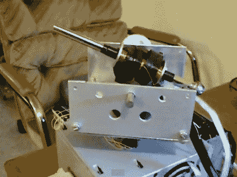

# 桌面 Coilgun 让你在你的客厅玩焦土

> 原文：<https://hackaday.com/2011/11/29/desktop-coilgun-lets-you-play-scorched-earth-in-your-living-room/>

几年前，当[韦斯特博士]结束他的大学学业时，他为他的毕业设计制作了一个非常酷的线圈。这把枪是为了模拟现实生活中的焦土电脑游戏而建造的，但由于时间限制，他只能建造一个炮塔，而不是两个。

这个炮塔主要是用回收的部件建造的，其中大部分来自旧的激光打印机和台式电脑。炮塔位于计算机 PSU 的顶部，这也是 coilgun 的充电电源。一个 Rabbit 2000 微控制器用来驱动枪，这是我们在过去的项目中所熟悉的东西。

火炮可以通过附带的键盘手动瞄准，但我们更喜欢更真实的路线，允许炮塔在获得 X 和 Y 坐标后自行瞄准。正如你在演示视频中看到的，coilgun 工作得很好，允许 West 博士]从房间的另一端击中目标。

我们喜欢这个概念，并认为用一对这样的炮塔来玩一场真实的焦土游戏会非常有趣。如果你有兴趣自己制作一个，你可以在他的公共邮箱里找到他最后一个项目的文章。