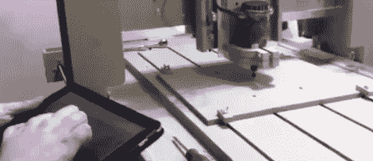

# 用路由器画极端的手指画

> 原文：<https://hackaday.com/2011/11/29/extreme-finger-painting-with-a-router/>

大多数时候，数控机床是用于非常精确和苛求。还有另一种方式，允许对路由器和工厂采取更“动手”的方法，允许更多的创造力和自由。这些家伙发明的 touchCNC 允许任何人用该死的路由器用手指画画。

根据这些人发来的论坛帖子，他们为平板电脑编写了一个简单的 Android 应用程序，可以通过触摸界面控制路由器。该软件有三个部分。一个 Android 应用程序将手指位置发送到运行在 CNC 计算机上的 java 服务器。该服务器将 gcode 转储到一个文本文件中。路由器软件中的 vbscript 会不断读取指定的文件。有了这些，手指的运动就直接转化成了机器的运动。

控件相当简单，就像现实生活中的微软画图。当然，有一个“点击 GOTO”命令可以将路由器移动到指定的位置。用“长敲击”将刳刨机钻头降低到工件上，并保持降低直到手指松开。

你可以查看 touchCNC 的[代码](http://code.google.com/p/touch-cnc/)，但他们正在开发一些额外的功能，比如将平板电脑的陀螺仪输出转换为 gcode。在那之前，请欣赏休息后大家上传的视频。

 <https://www.youtube.com/embed/TGr4-Wz8b6o?version=3&rel=1&showsearch=0&showinfo=1&iv_load_policy=1&fs=1&hl=en-US&autohide=2&wmode=transparent>

 <iframe class="youtube-player" width="800" height="480" src="https://www.youtube.com/embed/B8EaDFxyYQU?version=3&amp;rel=1&amp;showsearch=0&amp;showinfo=1&amp;iv_load_policy=1&amp;fs=1&amp;hl=en-US&amp;autohide=2&amp;wmode=transparent" allowfullscreen="true" style="border:0;" sandbox="allow-scripts allow-same-origin allow-popups allow-presentation"/> </body> </html>