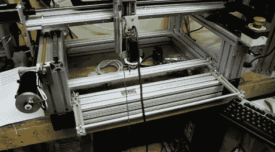

# OpenPnP 致力于创造一个负担得起的、完全开放的取放机器

> 原文：<https://hackaday.com/2011/11/30/openpnp-working-to-create-an-affordable-and-completely-open-pick-and-place-machine/>

如果你碰巧做了很多 SMD 工作，[一个取放机](http://code.google.com/p/openpnp/)是一个不可思议的时间节省器。问题是，大多数自动取放解决方案都超出了“小型装备”的价格范围，更不用说业余爱好者的预算了。

我们已经在这里看到了一些很棒的 DIY(T2)实现，尽管大多数都缺乏专业特性或者那种便于他人复制的文档。OpenPnP 项目正在寻求改变，它是一个完全开源的硬件和软件解决方案，目标价格在 1000 美元以下。

事情已经进展顺利，在[项目的维基中有大量的细节。](http://code.google.com/p/openpnp/wiki/OpenPnP?tm=6)根据开发页面，一个原型将在不久的将来投入建设，拾放控制软件的开发进展顺利。

虽然 OpenPnP 项目看起来很棒，但他们总是可以利用一些帮助来保持进展。如果你有兴趣伸出援手，请务必查看项目页面。

为了看到一些正在取得的进展，留下来看看一个简短的演示视频的控制软件和相机的行动。

[通过[使](http://blog.makezine.com/archive/2011/11/openpnp-aims-to-create-an-oshw-pick-n-place-machine.html)

[https://www.youtube.com/embed/sTWdujEdT1k?version=3&rel=1&showsearch=0&showinfo=1&iv_load_policy=1&fs=1&hl=en-US&autohide=2&wmode=transparent](https://www.youtube.com/embed/sTWdujEdT1k?version=3&rel=1&showsearch=0&showinfo=1&iv_load_policy=1&fs=1&hl=en-US&autohide=2&wmode=transparent)