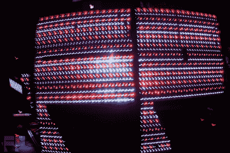

# 定制大型 LED 面板点亮派对

> 原文：<https://hackaday.com/2011/11/30/custom-massive-led-panel-lights-up-the-party/>

BuildLounge 的家伙写信给我们，分享他们在目前正在进行的[“赢得激光切割机”竞赛](http://www.buildlounge.com/2011/10/07/buildlounge-and-full-spectrum-lasers-are-giving-away-a-laser-cutter/)的提交堆中偶然发现的[巨型 LED 标志](http://www.buildlounge.com/2011/11/30/contest-entry-giant-fantasticplanet-led-sign/)。[斯蒂芬·谢弗]帮助经营一个名为“梦幻星球”的大型派对，该组织通常将灯光布置外包出去。他们厌倦了一年几次雇用光家伙，而是为庆祝活动建造自己的大型展示。

LED 标志由 1，474 个输出超过 10，000 流明的 LED 组成。这个标志的制作成本仅为 800 美元，对于这种规模的展示来说是非常合理的。整个系统由一对 Arduinos 和 34 个 MIC5891 移位寄存器控制，所有这些寄存器都安装在该小组内部生产的定制设计的 PCB 上。

显示器看起来很棒，但不要相信我们的话——看看下面的视频，看看它的实际效果。

如果您有兴趣仔细看看它是如何构建的，请转到[构建线程查看更多细节。](http://www.electro-tech-online.com/general-electronics-chat/113042-questions-about-powering-leds-large-matrix-like-mikes-macmux-design.html)

 <https://www.youtube.com/embed/P9J-kIuw6Q8?version=3&rel=1&showsearch=0&showinfo=1&iv_load_policy=1&fs=1&hl=en-US&autohide=2&wmode=transparent>

 </body> </html>